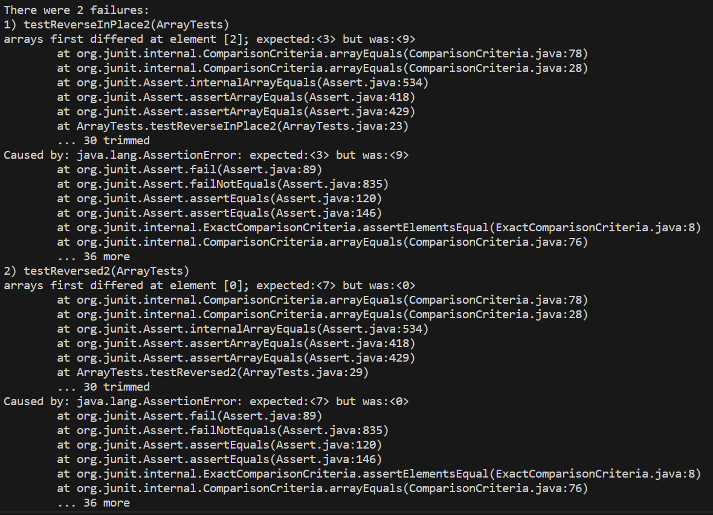

### LAB 3 

 

The image above shows a failure-inducing input for the buggy program of ArrayExamples through testing in ArrayTests.

~~~
  static void reverseInPlace(int[] arr) {
    for(int i = 0; i < arr.length; i += 1) {
      arr[i] = arr[arr.length - i - 1];
    }
  }

  static int[] reversed(int[] arr) {
    int[] newArray = new int[arr.length];
    for(int i = 0; i < arr.length; i += 1) {
      arr[i] = newArray[arr.length - i - 1];
    }
    return arr;
  }
  
~~~

The code block above shows the buggy method of reverseInPlace and reversed that caused the failure in testing.
