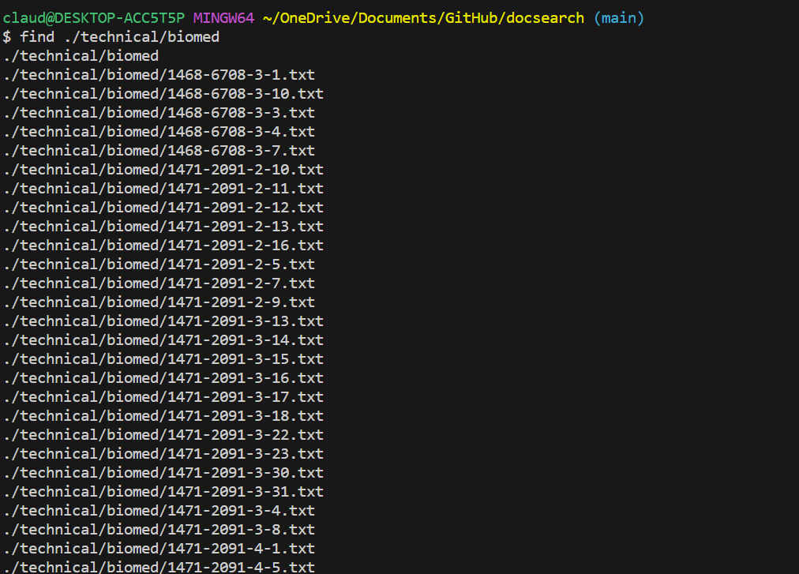
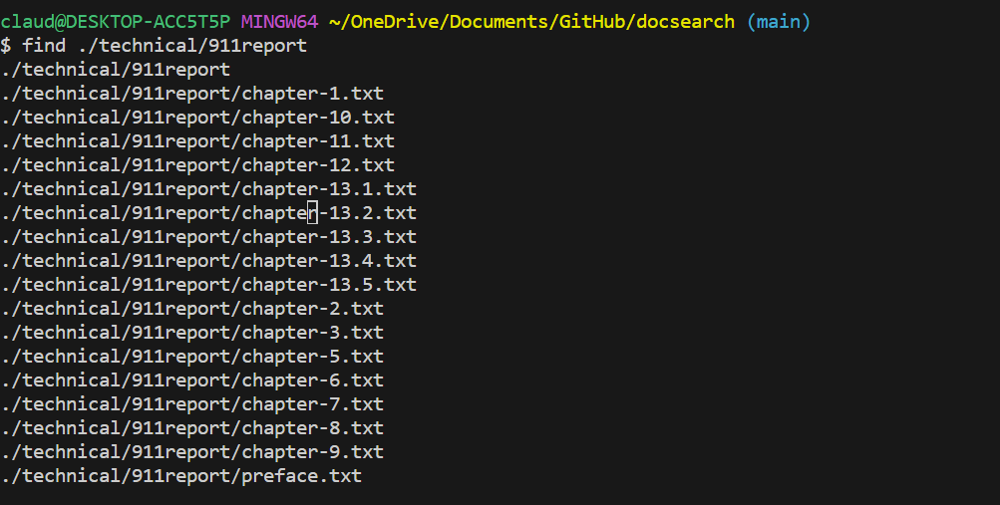
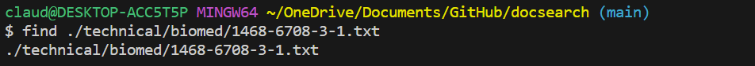
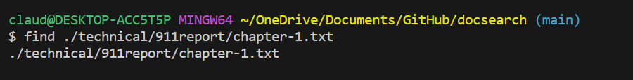
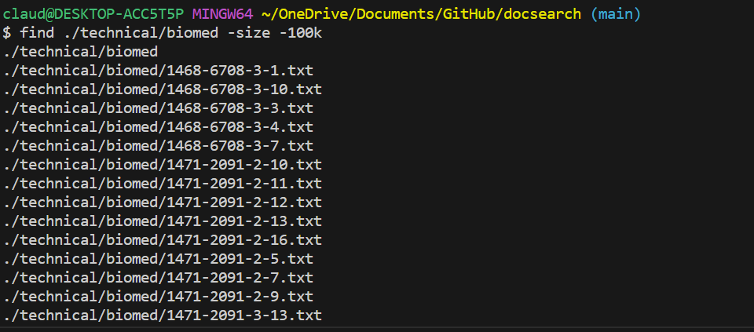
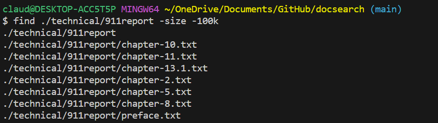
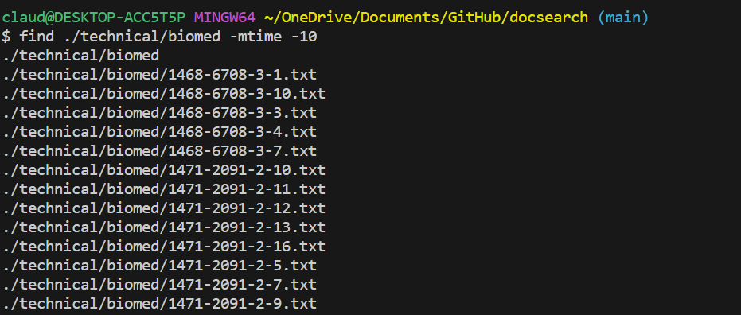
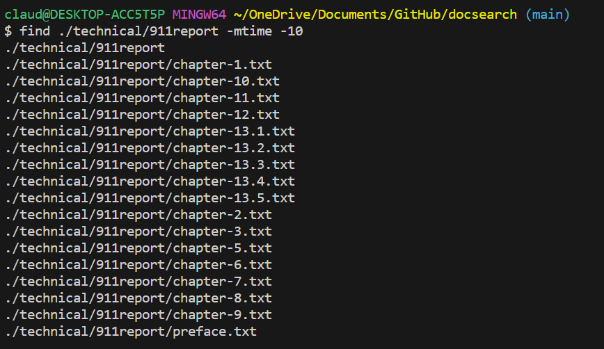

### LAB 3 
# Part 1

 

The image above shows a failure-inducing input for the buggy program of ArrayExamples through testing in ArrayTests. The JUNIT test displays the failure of this input.

~~~
@Test
  public void testReverseInPlace2(){
    int[] input1 = { 3 , 6 , 9};
    ArrayExamples.reverseInPlace(input1);
    assertArrayEquals(new int[]{ 9 , 6 , 3 }, input1);
  }

  @Test
  public void testReversed2() {
    int[] input1 = { 5, 6 , 7};
    assertArrayEquals(new int[]{ 7, 6 , 5}, ArrayExamples.reversed(input1));
  }
~~~

The code block above shows the test that fails to the buggy program.

 

The image above shows an input that doesn't induce failure to the buggy program. The JUNIT test shows that these tests pass the methods.

~~~
@Test 
	public void testReverseInPlace() {
    int[] input1 = { 3 };
    ArrayExamples.reverseInPlace(input1);
    assertArrayEquals(new int[]{ 3 }, input1);
	}

  @Test
  public void testReversed() {
    int[] input1 = { };
    assertArrayEquals(new int[]{ }, ArrayExamples.reversed(input1));
  }
~~~
The code block above shows the test that passed to the buggy program. 

~~~
  static void reverseInPlace(int[] arr) {
    for(int i = 0; i < arr.length; i += 1) {
      arr[i] = arr[arr.length - i - 1];
    }
  }

  static int[] reversed(int[] arr) {
    int[] newArray = new int[arr.length];
    for(int i = 0; i < arr.length; i += 1) {
      arr[i] = newArray[arr.length - i - 1];
    }
    return arr;
  }
  
~~~

The code block above shows the buggy method of reverseInPlace and reversed that is used for testing the inputs.

~~~
  static void reverseInPlace(int[] arr) {
    for(int i = 0; i < arr.length/2; i += 1) {
       int temp = arr[i];
       arr[i] = arr[arr.length - i - 1];
       arr[arr.length - i - 1] = temp;
      
    }

static int[] reversed(int[] arr) {
    int[] newArray = new int[arr.length];
    for(int i = 0; i < arr.length; i += 1) {
      newArray[i] = arr[arr.length - i - 1];
    }
    return newArray;
  }
~~~

The code block above shows the fixed version of methods reverseInPlace and reversed.

The bug in reverseInPlace method was that it reverses the array but all the elements are the last element and the array does not have the correct elements. To fix this, I created a temporary array that stores the original element before overwriting it by reversing it. In addition, the iteration is changed to half the array length as the middle elements usually stay the same, and only the first few elements and last few elements are switched. The bug in the reversed method is that instead of copying the original array to the new array, it is copying the new array to the original array. To fix this, I changed the order of the code to ensure that the original array is copied to the new array.

# Part 2 (Using find command)
 
 

The above images show the use of the find command with the path of the directory for the 911report directory and biomed directory, which is -type d for directory type. The command is used to show the content of the directories such as the files within the 911report directory and filed within the biomed directory. This is helpful to find the content of the directory that you want to know more about or find files within the directory.
Cited source: https://tecadmin.net/linux-find-command-with-examples/ 

 
 

The above images show the use of the find command with the path of the file name for the 911report directory and biomed directory, which is type f for file type. The command is used to search and show the content of the called file. This is helpful to search for a specific file to see if it exists.
Cited source: https://tecadmin.net/linux-find-command-with-examples/

 
 

The above images show the use of the find command with another command of a size where this line of command finds files within the called directory of a specified size such as finding content with the size of 100KB. This line of command is called on the 911report directory and biomed directory where the command specified content with the size of 100KB and the output files with the size of 100 KB. This is helpful for finding file sizes that are not too big or small for your preference.
Cited source: https://tecadmin.net/linux-find-command-with-examples/

 
 

The above images show the use of the find command with another command of time where this line of command finds files that are modified within the last 10 days within the called directory. The line of command is called on the 911report and biomed directory where the command specified content that was modified in the last 10 days and the output is files that have been modified within the last 10 days. This is helpful for finding files when you don't know the exact name but you know approximately when you modified it.
Cited source: https://tecadmin.net/linux-find-command-with-examples/

